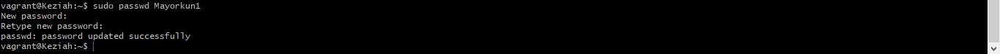

# AltSchool-Cloud-Engineering-Assignments

#CONTENTS: 
Descriptions
Screenshots/Solutions

# Step 1- Create a User account:

Description: Creating a user account called "Mayorkun" using sudo useradd command:

Description: Confirming the user account created using cat /etc/passwd command:

# Step 2- Set an expiry date of 2 weeks for the user account:

Description: Setting expiry date for the user account "Mayorkun1":

Description: Confirming the expiry date of the user:

# Step 3- Prompt user to change password on next login:

Description: Setting prompt to request for password and Logging out:

Description: Testing the prompt:

Description:  Adding a new password: 

# Step 4- Attach a user to a group called AltSchool:

Description: Creating a newgroup called AltSchool:

Description: Adding the user "Mayorkun" to the new group:

# Step 5- Allow Altschool group to run only cat commands:

Description: Giving cat command priviledges to the group "AltSchool"

# Step 6- Create another user. Make sure it doesn't have a home directory
Description: Creating another user without a home directory:

Description: Confirming if the user is available on the ome directory:

