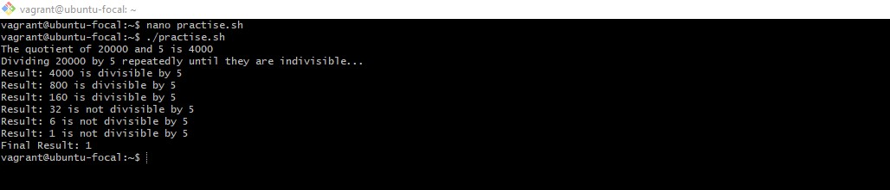
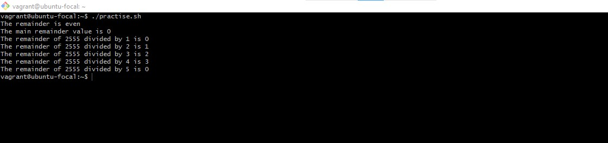
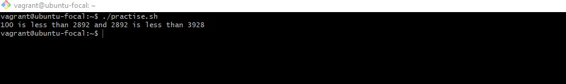
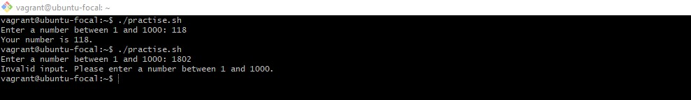
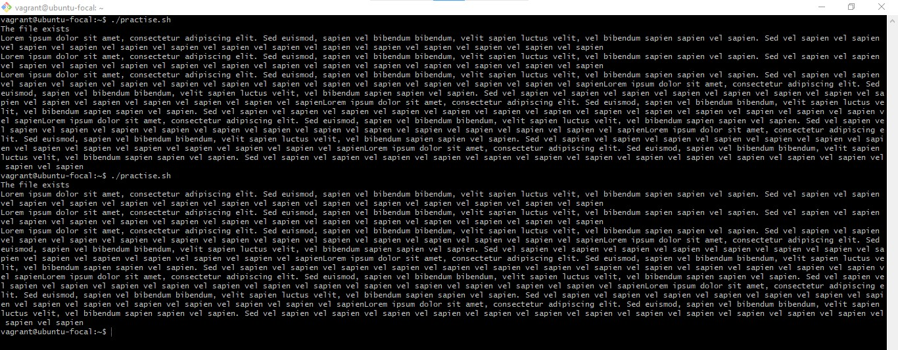
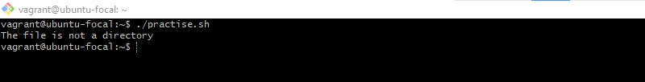
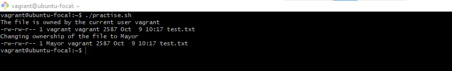
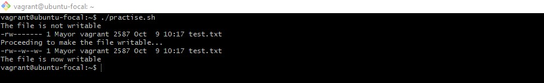
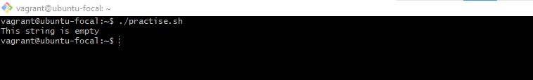
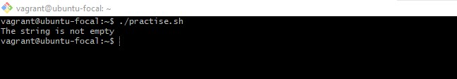

## Task: 
Write out *at least* 15 bash script operators, their description and examples of their usage.

## Solution:
### Description:
This task contains the types of bash script operators, their description and screenshots examples of their usage.

### Bash Script Operators:
## 1. Arithmetic Operators:
Arithmetic operators are used to perform mathematical operations like addition, subtraction, multiplication, division, modulus, increment, decrement, etc. 

# Example a: Multiplication(*) Operator:
# The `*` operator is used to multiply two or more values together. 
# This script and screenshot below shows the description and usage of the multiplication operator.

value1=5
value2=6
product=$((value1 * value2))
echo "The product of $a and $b is $product"

if [ $product -gt 30 ]
then
    echo "The product is greater than 30"
else
    echo "The product is less than or equal to 30"
fi
**

# Example b: Division (/) Operator
# The `/` operator is used to divide two or more values/variables by another value.
# This script and screenshot below shows the description and usage of the division operator.
value1=20000
value2=5

if [ $value1 -gt $value2 ]
then
    quotient=$((value1 / value2))
    echo "The quotient of $value1 and $value2 is $quotient"

    echo "Dividing $value1 by $value2 repeatedly until they are indivisible..."
    while [ $value1 -gt $value2 ]
    do
        value1=$((value1 / value2))
        if [ $((value1 % 5)) -eq 0 ]
        then
            echo "Result: $value1 is divisible by 5"
        else
            echo "Result: $value1 is not divisible by 5"
        fi
        sleep 2s
    done
    echo "Final Result: $value1"
else
    echo "Value1 is not greater than Value2"
fi
**

# Example c: Modulus(%) Operator
# The `%` operator is used to find the remainder of a division operation.
# This script performs modulus operations on two variables, checks if the remainder is odd or even, calculates the main remainder value using the `bc` command, and outputs the remainder of the first variable divided by each number from 1 to the second variable.

value1=2555
value2=5
remainder=$((value1 % value2))

if [ $remainder -eq 1 ]
then
    echo "The remainder is odd"
else
    echo "The remainder is even"
fi

echo "The main remainder value is $(bc -l <<< "$value1 % $value2")"

for i in $(seq 1 $value2)
do
    echo "The remainder of $value1 divided by $i is $((value1 % i))"
done

**

### 2. Relational Operators:
## Relational operators are used to compare two values. The types of relational operators are: equal to, not equal to, greater than, less than, greater than or equal to, and less than or equal to. The screenshots below shows the relational operators, their description and examples of their usage.

# Example d: Equal to (=) Operator
# The `=` operator is used to compare two values and check if they are equal or not. The comparison is case-sensitive.
# This script compares two variables "var1" and "var2" and checks if they are equal or not. If the variables are equal, the script outputs a message saying that they are equal and displays the value of var1. If the variables are not equal, the script outputs a message saying that they are different because the comparison is case-sensitive.

var1="GRAPE"
var2="grape"

if [ "$var1" == "$var2" ]
then
    echo "The variables are equal, and they both say $var1"
else
    echo "The comparison is case-sensitive, so $var1 and $var2 are considered different."
fi

**

## Example e: Comparison  using the` lt` and `&& `operators
# The `lt` operator is used to compare two values and check if the first value is less than the second value. The `&&` operator is used to perform logical operations on expressions(true or false). The expression is true if both operands are true.
# This script compares three variables "value1", "value2" and "value3" and checks if value1 is less than value2 and value2 is less than value3. If the condition is true, the script outputs a message saying that value1 is less than value2 and value2 is less than value3. If the condition is false, the script outputs a message saying that value1 is not less than value2 and value2 is not less than value3.

value1=100
value2=2892
value3=3928

if [ $value1 -lt $value2 ] && [ $value2 -lt $value3 ]
then
    echo "$value1 is less than $value2 and $value2 is less than $value3"
else 
    echo "$value1 is not less than $value2 and $value2 is not less than $value3"
fi

**

## Example f: Comparison using the `gt` and `||` operators
# The `gt` operator is used to compare two values and check if the first value is greater than the second value. The `||` operator is used to perform logical operations on expressions(true or false). The expression is true if either of the operands is true.
# This script compares three variables "value1", "value2" and "value3" and checks if value1 is greater than value2 or value2 is greater than value3. If the condition is true, the script outputs a message saying that value1 is greater than value2 or value2 is greater than value3. If the condition is false, the script outputs a message saying that value1 is not greater than value2 or value2 is not greater than value3.

value1=10000
value2=2892
value3=3928

if [ $value1 -ge $value2 ] || [ $value2 -le $value3 ]
then
    echo "$value1 is greater than or equal to $value2 or $value2 is less than or equal to $value3"
else
    echo "$value1 is less than $value2 and $value2 is greater than $value3"
fi

**

## Example g: Comparison using the `!=` operator
# The NOT `!=` operator is used to compare two values and check if they are not equal. 
# This script defines two variables "fuel_price" and "dollar_rate" with sample values. It then uses an if statement to compare the values of the two variables using the `!=` operator. If the variables are not equal, the script outputs "The current fuel price in Nigeria is not equal to the dollar rate". Otherwise, it outputs "The current fuel price in Nigeria is equal to the dollar rate".

fuel_price=190.00
dollar_rate=1000.00

if [ $fuel_price != $dollar_rate ]
then
    echo "The current fuel price in Nigeria is not equal to the dollar rate"
else
    echo "The current fuel price in Nigeria is equal to the dollar rate"
fi

**

### 3. Boolean Operators:
## Boolean operators are used to perform logical operations on expressions(true or false). The types of boolean operators are: AND, OR, NOT. The screenshots below shows the boolean operators, their description and examples of their usage.

# Example h: AND (&&) Operator
# The `&&` operator compares two expressions and returns true if both expressions are true. The expression is true if either of the operands is true. 
# This script prompts the user to input their age and checks if the age is greater than or equal to 18 using the AND operator (&&) and the increment operator (++). If the condition is true, the script outputs "You are eligible to vote". Otherwise, it outputs "You are not eligible to vote".

read -p "Enter your age: " age

if [ $age -ge 18 ] && ((++age))
then
    echo "You are eligible to vote"
else
    echo "You are not eligible to vote"
fi

**

## Example i: OR (||) Operator
# The `||` operator is used to perform logical operations on expressions(true or false). The expression is true if either of the operands is true.
# This script prompts the user to input their age and checks if the age is less than 18 using the OR operator (||) and the decrement operator (--). If the condition is true, the script outputs the corresponding message in the if statement. Otherwise, it outputs the corresponding message in the else statement as shown in the screenshot below.

# Prompt the user to enter a number and Check if the number is less than 1 or greater than 1000
read -p "Enter a number between 1 and 1000: " num

if [ $num -lt 1 ] || [ $num -gt 1000 ]
then
    echo "Invalid input. Please enter a number between 1 and 1000."
else
    echo "Your number is $num."
fi

**

### 4. File Test Operators:
## File test operators are used to perform operations on files. The types of file test operators are: -e, -f, -d, -s, -r, -w, -x, -O, -G. The screenshots below shows the file test operators, their description and examples of their usage.

# Example j: -e Operator
# The `-e` operator is used to check if a file exists or not.
# This script checks if a file named "test.txt" exists in the current directory. If the file exists, the script outputs "The file exists". Otherwise, it outputs "The file does not exist".

if [ -e test.txt ]
then
    echo "The file exists"
    cat test.txt
else
    echo "The file does not exist"
fi

**

# Example k: -d Operator
# The `-d` operator is used to check if a file is a directory or not.
# This script checks if a file named "var" is a directory or not. If the  directory exists, it list contents using ls -al command
if [ -d /home/vagrant/var ]
then
    ls -l /home/vagrant/var
else
    echo "The file is not a directory"
fi

**

# Example l: -O Operator
# The `-O` operator is used to check if a file is owned by the current user or not.
# This script checks if a file named "test.txt" is owned by the current user or not. If the file is owned by the current user, the script outputs the file details and changes the ownership of the file to "Mayor". Otherwise, it outputs "The file is not owned by the current user".

file="test.txt"

if [ -O $file ]
then
    echo "The file is owned by the current user vagrant"
    ls -l $file
    sleep 2s
    echo "Changing ownership of the file to Mayor"
    sudo chown Mayor $file
    ls -l $file

else
    echo "The file is not owned by the current user"
fi

**

# Example m: -w Operator
# The `-w` operator is used to check if a file is writable or not.
# This script checks if a file named "test.txt" is writable or not. If the file is writable, the script outputs "The file is writable". Otherwise, it outputs "The file is not writable".

if [ -w test.txt ]
then
    echo "The file is writable"
else
    echo "The file is not writable"
    sleep 2
    ls -l test.txt 
    echo "Proceeding to make the file writable..."
    sleep 2
    sudo chmod 622 test.txt
    sleep 2
    ls -l test.txt 
    sleep 2
    echo "The file is now writable"
fi

**

### 5. String Operators:
## String operators are used to perform operations on strings. The types of string operators are: =, !=, -z, -n. The screenshots below shows the string operators, their description and examples of their usage.

# Example n: -z Operator
# The `-z` operator is used to check if a string is empty or not.
# This script checks if a string named "string_name" is empty or not. If the string is empty, the script outputs "This string is empty". Otherwise, it outputs "The string is not empty".

stringName=""

if [ -z $stringName ]
then
    echo "This string is empty"
else
    echo "The string is not empty"
fi

**

# Example o: -n Operator
# The `-n` operator is used to check if a string is not empty.
# This script checks if a string named "string_name" is not empty. If the string is not empty, the script outputs "The string is not empty". Otherwise, it outputs "This string is empty".

stringName="Hello Ubuntu"

if [ -n $stringName ]
then
    echo "The string is not empty"
else
    echo "This string is empty"
fi

**

